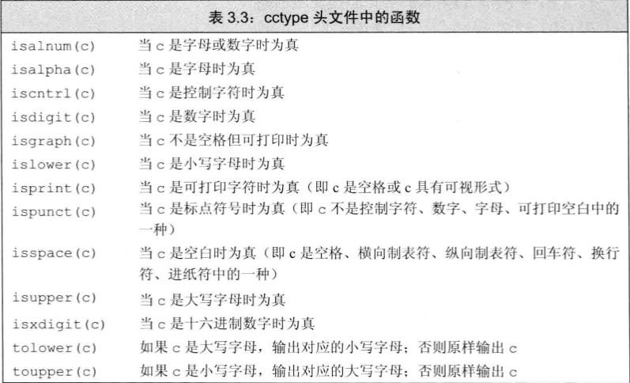
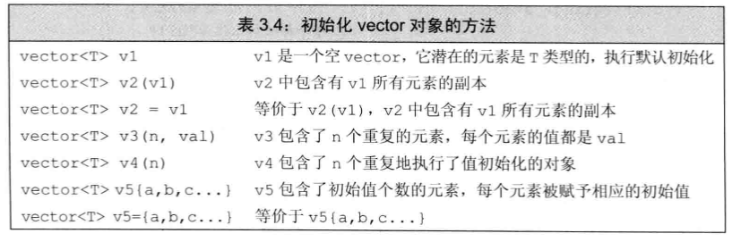
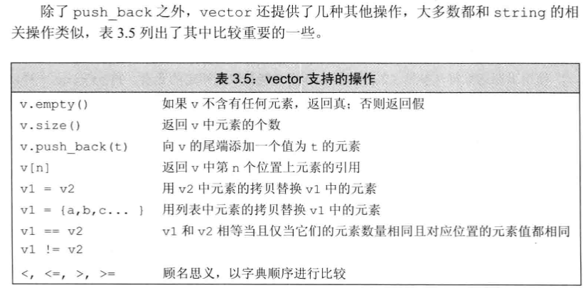
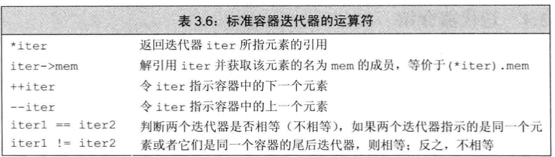
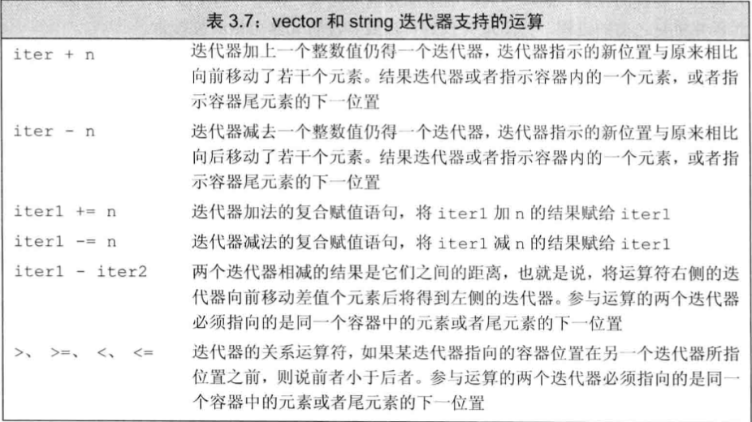
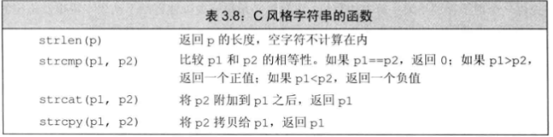

1.using声明

```
格式：using namespace::name ;
//用于获取在某一个namespace下的name
例如，在文件开头写下：using std::cin;
之后使用cin就可以不需要写成std::cin的格式

ps：为了方便可以使用using namespace std;直接省略了所有std命名空间下的全部域操作

但是在自定义的头文件中就最好不要使用using ,否则在其他文件引用它的时候容易产生问题。
```

2.string

```
string s1(s2);  ==  string s1 = s2;
string s3(n,'c');// s3赋值为n个c

string ci;
cin>>ci; //如果输入hello world，只会存储hello（从第一个字符到第一个空格截止，第一个字符前的空格会被自动忽略。
getling(cin,ci);//则一直读取到换行符，但是换行符本身并不会存储进string变量ci中

//对于size():
string s;
auto cnt = s.size(); //因为size返回的数据类型是string::size_type，很可能会是无符号型，如果强行命名为int型会容易出问题，因为无符号的负数会变成一个很大的整数。

string使用+,则必须要保证+号两侧都有string变量：
s1+" "+s2//对    "1" + "1"//错
但可以利用括号优先运算  (s1+"1")+"1" //对
字符串字面值与string是不同类型

//一种for循环的快捷写法
for(auto c : str){
	xxxxx
}
//类似的，对于list：
for(int i : nums){
	//这里nums是一个数组的名字
	//这是一个比较方便的写法，但是不会返回对应的字所在的索引值。
	//所以当需要用到索引的时候，还是要按正常的那种来写比较好。
}

循环变量定义为引用类型可以修改原str的值!
例如:
for(auto c : xxstr ){ //这样写c是新定义的一个临时变量，对c做出的改变不会影响原数组内容。
}//因为这里相当于c = str[0];然后改变c的时候，不会对str[0]产生影响。
for(auto &c :xxstr){}//c是引用型临时变量，修改引用的值实际上就是修改原变量的值，所以会改变数组的内容。
```



3.vector模板

```
vector<内部存储的元素类型> 变量名;
vector可以容纳绝大多种对象的元素类型，但是不支持引用（引用不是对象）
对于早期的编译器，嵌套vector声明语句要写成
vector<vector<int> >
而不是
vector<vector<int>>

初始化部分要注意！
vector<int> v1(10);//包含了10个初始化为0的int
vector<int> v2{10};//包含了1个初始化为10的int
vector<int> v3(10,1);//包含了10个初始化为1的int
vector<int> v4{10,1};//包含了两个初始化分别为10,1的int
如果是 vector<string> v5{10,"hi"} 这种，由于10不是字符串类型，会被编译器解释为初始化10个string
```





4.迭代器（对与string，还有像vector的一系列模板，都有迭代器）



```
创建迭代器：
string s = "hello";
auto it = s.begin();
*it //解引用，it是迭代器，而*it就是其指向的字符'h',对字符本身的操作都需要包含解引用
auto e = s.end();//这里e实则存储的是字符串最后一位所在的位置的后一位，主要起标签作用。

//利用迭代器的循环
for(auto it = s.begin();it!=s.end();it++){
	*it = toupper(*it);
}
在使用了迭代器的循环体内部，不能添加（push_back）元素！否则可能会导致当前循环的迭代器失效。

//begin与end的返回类型
vector<int> v1;
const vector<int> v2;
auto b1 = v1.begin();//这里b1类型为vector<int>::iterator
auto b2 = v2.begin();//b2类型为vector<int>::const_iterator
当需要读而不需要修改的时候，可以写 auto b1 = v1.cbegin();来获得const常量型迭代器。同理还有cend();

//如果迭代器所指对象有其他操作，需要加括号，比如vector<string> 里指向string的迭代器   可以用(*it).empty() 来判断其中的string是否为空
但是还有简化方式：   it ->empty() 用箭头运算符来代替解引用和点运算符

用迭代器进行二分查找:
auto begin = text.begin(),end = text.end();
auto mid = text.begin()+(end-begin)/2;
while(mid != end &&*mid != target ){
	if(sought < *mid) end = mid;
	else begin = mid+1;
	mid = begin + (end - begin)/2;
}
//因为c++中对于迭代器之间的运算只有减法，没有加法，所以只能写(end-begin)/2来获得相对位置后进行相加。
```



5.数组

```
constexpr unsigned sz = 42;
int arr[sz];//可以用常量表达式来定义数组！但是如果不是常量表达式（没有const）则不行。对于不确定大小的，最好使用vector。由于编译器的扩展，部分编译器可以支持非常量表达式定义数组，但不建议这么写，容易在其他编译器环境下失效。

数组的初始化和其他变量一样，如果定义在函数体内，不会被初始化，很可能是未定义的值。但是如果定义在函数体外，就会被执行默认初始化。

数组的大小不能像vector那样直接调用size函数，只能写：sizeof(array)/sizeof(array[0])来进行计算

和vector一样，数组的元素为对象，所以不存在元素为引用的数组。但数组本身是对象，所以可以有对数组的引用。
int *ptrs[10];//ptrs是含有十个整型指针的数组
int &refs[10];//不可以！数组存储的必须是对象
int (*parray)[10] = &arr;//指针parray指向了一个含有10个整数的数组
int (&arrRef)[10] = arr;//引用arrRef 引用了一个含有十个整数的数组。
对左边采用由内向外阅读的方式。
int *(&arry)[10] = ptrs;//arry是一个对数组的引用，引用的数组内含有10个整型指针

可以用字符串的字面值来初始化字符数组（char）（这里主要因为字符串字面值与字符串实际不是同一种数据类型）
char a[] = "c++";//数组大小为4
char a[6] = "123456";//错误，因为还要包含结尾的"\0"空字符，所以大小至少为7.

不能够直接将一个数组赋值给另一个数组，或者初始化另一个数组。应当考虑利用下标和循环。
但是vector可以。

对于大多数情况，使用数组类型作为对象，其实就是以数组第一位所在地址的指针作为对象。
int a1[]={0,1,2,3};
auto a2(a); //此时a2是一个int型指针，指向a[0];本句 == auto a2(&a1[0]);
a2 = 42;//错误，指针不能赋值一个普通整型
此时auto 和decltype的效果不同。
decltype(a1) a3 = {0,1,2,3};//得到的a3是一个整型数组，而非整型指针。
int last = *(a1 +3); //通过解引用得到了a1[3] (即 3)
int last2 = *a1 + 3; //== a[0] + 3

int *p = ia;
== int *p = &ia[0] ; 
!= int *p = &ia[1];

使用指针模拟迭代器的操作！虽然数组不能使用.begin这种，但是可以使用：
int *first = begin(arr1);
int *last = end(arr1);
来获得arr1的头指针和指向尾元素的下一位置的指针。

用字符数组来模拟字符串的操作：
字符数组最后必须以\0为结尾！！！
char ca[4] = {'c','a','t','\0'};
如果没有\0，在使用一些字符串处理的函数（指从c语言继承的）时会产生比较严重的错误。因为函数无法判断这个字符串已经到头了（如果没有遇到'\0'的话），会一直向前继续查找，直到遇到'\0'空字符。（很可能会影响到你不想让它动的那部分空间！）
PS：关于库函数
<cstring>与<string> 是两个不同的库。前者是c语言中string.h的c++版本，后者是标准库（STL）中的类模板。通常更建议使用后者。

...字符串数组也是可以直接输出的
cout<<ca<<endl; //输出cat

混用string与cstring （3.5.5与旧代码的接口）:
string 可以用c语言风格的字符串（即char数组）进行赋值，相加。
如果要赋值一个指针，不能用string，但是可以用char数组。所以可以用：
const char *str = s.c_str();//来获得一个s字符串的char数组的指针。（但这样之前最好先拷贝一下这个char数组。

同样的，vector可以用数组进行初始化。（需要利用到头指针和尾后指针）
如：vector<int> v2(begin(arr_int),end(arr_int));//获得的向量数组，初始值即为arr_int的所有值。
而 vector<int> v3(arr_int,arr_int+3);//则复制了arr_int数组中0,1,2三个元素。

线代的c++程序，比起字符数组，整型数组之类的，更佳推荐使用vector和string

```



6.多维数组

```
int (&row)[4] = ia[1];//可以知道，ia是二维数组，并且第二维是一个四元数组。
所以这里row绑定的是ia第二行的那个四元数组。
如果使用范围for循环来处理多维数组，最好除了最内层的循环外，其他所有循环变量都应该是引用类型。
例如：for(const auto &row: ia){
		for(auto col:row){
			cout<<col<<endl;
		}
}//因为这里的row是一个数组，使用引用类型可以直接引用到这个数组。如果不用引用类型的话，会在这个位置创建一个指针对象，指向row的第一个元素。就不符合第二层for循环的要求了。

当程序调用多维数组的名字时候，其实会自动转换为指向数组首元素的指针。
int ia[3][4];
int (*p)[4] = ia;//理解：p是一个指针，指向一个四元数组，这个数组元素是整型。
//!= int *p[4];//这个是表示一个四元数组p，其中存了4个整型指针。
```

